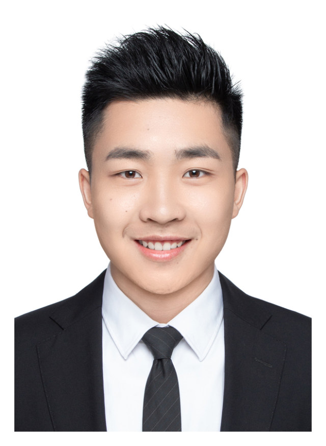

 # &emsp;&emsp;&emsp;苏 涛 &emsp; 求职意向：深度学习算法工程师 

**学校**：武汉理工大学&emsp;&emsp;&emsp;&emsp;&emsp;&emsp;**学历**：硕士&emsp;&emsp;&emsp;&emsp;&emsp;&emsp;&emsp;**专业**：自动化&emsp;&emsp;&thinsp;

**邮箱**：sutao_stan@163.com&emsp;&emsp; **电话**：15871409930&emsp;&emsp;&emsp;**毕业时间**：2022年

## 🎓教育经历

**武汉理工大学** - 控制科学与工程 - 学术型硕士 - 自动化学院                              2019年07月 - 2022年06月

**武汉理工大学** - 自动化专业 - 本科 - 自动化学院                                                 2015年09月 - 2019年06月

## 🎨工作经历

**新一代跨平台音乐评测引擎**                                                                                     2022年08月 - 2022年10月

- **Situation：**线上音乐评测引擎架构混乱，技术老旧，亟需升级成深度学习技术和引擎架构，并支持跨平台构建，满足云端部署和本地端部署需求；
- **Task：**开发音乐评测引擎，支持多路并发，三天完成10w+条数据评测，稳定运行三天无内存泄漏无崩溃，支持Linux和Android系统；
- **Action 1：**推动多方协商，制定引擎的输出和输出功规；
- **Action 2：**学习CMake构建工程和C++ 11的编程基础；
- **Action 3：**基于AIOE口语评测引擎架构，实现音乐评测题型独立引擎；使用onnxinfer组件(基于onnxruntime)，实现基于c++端onnx模型的推理，并对齐c++端和python端一致性；
- **Action 4：**以xlite组件替换onnxinfer组件实现端侧onnx模型的推理；
- **Action 5：**通过交叉编译，用Android NDK在Linux上编译Android系统armV8板子的动态库引擎；
- **Action 6：**实践出xlite组件的崩溃和一致性问题，同xlite组件开发人员一起修复问题；
- **Action 7：**使用adb技术完成端侧的一致性和稳定性验证；编译64位和32位两个版本的端侧引擎；
- **Result：**代码构建发版，快速入门c++开发并实践，掌握交叉编译技术，填补音乐引擎端侧空白，为业务拓展百万商机，已上线。

**中文实时背诵跟踪题型mocha-fa技术升级**                                                       2022年10月 - 2023年06月

- **Situation:** 线上使用转写引擎+match引擎+评测引擎实现背诵跟踪任务，现升级技术方案，新方案使用中文背诵跟踪引擎+评测引擎实现该功能;
- **Task:** 将引擎封装成python可调用版本，开发新方案代码，开发能提升onnx模型运算效率的batchflow组件;使AIOE引擎支持流式出多次结果；
- **Action 1:**  使用pybind11，将口语评测引擎的plug插件模块封装成python库，对齐一致性，实现多批次运行；
- **Action 2：**开发BPE分词和GPA字词发音对齐方案;
- **Action 3：**由于onnx内涉及逻辑判断的算子一致性失效，使用python对onnx文件切图，将ED模型切成四个子图，对齐在线计算下每个子图的一致性；
- **Action 4：**开发batchflow组件的batchbuild部分，实现存储在线push数据等、拼多inst的batch数据、计算try attention等操作，开发beamsearch功能，拉通整体流程，对齐整体ED模型的一致性；
- **Action 5：**根据对齐试卷功规，开发试卷解析模块，集成xtts组件实现发音预测功能；
- **Action 6：**集成Mocha-Fa模型，实现背诵跟踪功能，实现跟踪结果缓存和吐出功能，实现由ctc计算fa的功能；
- **Action 7：**发现batchflow的长音频限制，提出并开发mvad切分音频方案；
- **Action 8:**  受限于原型音频切分不准确的结果，负责从多角度验证效果，推动引擎上线;
- **Result:** 构建发版,测试三天无内存泄漏,无崩溃，已上线。

**中文朗读题型技术升级**                                                                          2023年06月 - 目前

- **Situation：**中文口语评测有模考、教考、学习机等引擎，技术方案各不相同，现采用mocha-fa为基本技术，在aioe引擎中统一中文朗读题型的技术方案。
- **Task：**协助设计部分模块的算法，并落地全流程方案。新增流式评测功能。
- **Action1：**搭建音素级试卷网络，设计并实现viterbi解码方案，封装成python版本供研究验证全流程方案效果；
- **Action2：**以标注引擎为骨架，开发中文试卷解析模块，实现中文朗读题、背诵跟踪题等多种类型试卷的试卷解析、数字发音预测功能；
- **Acition3：**设计mocha-ed模型的新切图方案，并开发相应的batchflow代码；以一期为基准，显存降低50%，响应速度提升57%；
- **Acition4：**调研并应用量化方案，修复onnxinfer组件中量化、推理的bug；
- **Result：**等待研究侧提高部分题型下的效果，引擎侧现阶段工作完结。

## 🥇校园经历

**SCI论文** 

1. **Tao Su**, Ying Shi, et al. Nonlinear compensation algorithm for multidimensional temporal data: A missing value imputation for the power grid applications[J]. Knowledge-Based Systems, 2021:106743, doi: 10.1016/j.knosys.2021.106743. (**SCI、EI 收录，IF:8.067**) 
2. **Tao Su**, Ying Shi * et al. A hybrid loss balancing algorithm based on gradient equilibrium and sample loss for understanding of road scenes at basic-level [J]. Pattern Analysis and Applications. (**SCI、EI收录，IF:2.580**) 
3. Y. Sun, Y. Shi, Q. Hu, C. Xie and **Tao. Su.** DTformer: An Efficient Digital Twin Model for Loss Measurement in UHVDC Transmission Systems[J]. IEEE Transactions on Power Systems, doi: 10.1109/TPWRS.2023.3278300.(**SCI、EI收录，IF:7.326**，**毕设**)
4. Du, Jiabao, Yue, Chang, Shi, Ying, Yu, Jicheng, Sun, Fan, **Su, Tao,** Xie, Changjun. A Frequency Decomposition-Based Hybrid Forecasting Algorithm for Short-Term Reactive Power[J]. Energies, 2021: 14(20):6606, doi:10.3390/en14206606. (**SCI、EI收录，IF:3.004**) 

**发明专利** 

1. 撰写过20+篇发明专利、实用新型专利、软件著作权等申请材料

## 🏆技能/证书及其他

- **研究和实践领域：** 多维数据挖掘和分析；目标检测；实例分割；命名实体识别；文本情感分类；数字信号处理。

- **技能：** python（熟练），matlab（熟练），c++ 11（掌握），gdb（掌握），Cmake（掌握），opencv（掌握），Tensorflow（掌握），Pytorch（掌握），Excel / Word / PowerPoint（熟练），Visio（熟练），Latex（掌握），Tableau（掌握），PhotoShop（掌握），SPSS（掌握）

- **证书/执照：** 计算机二级

- **语言：** 英语（CET-6）
